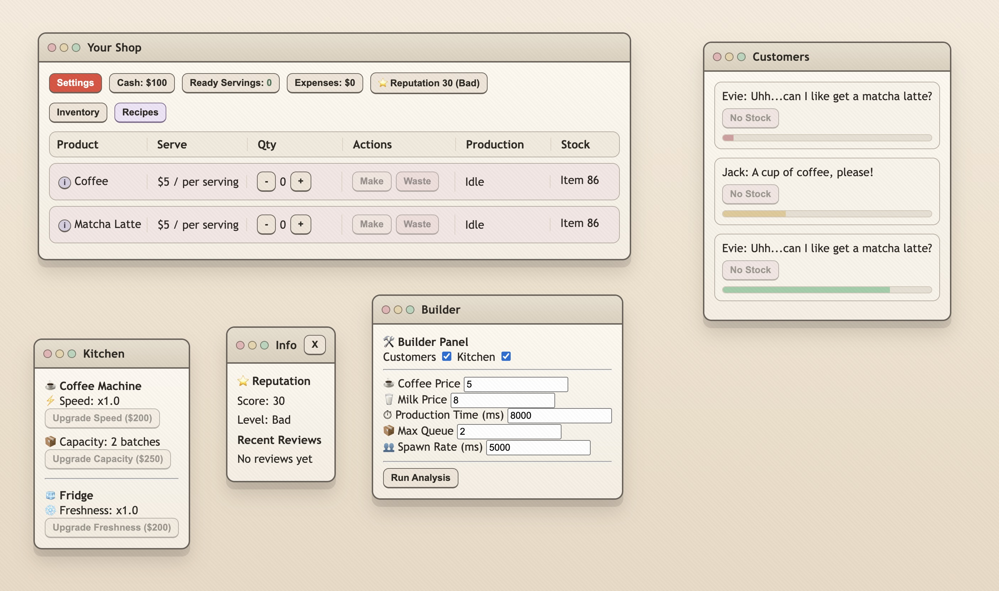
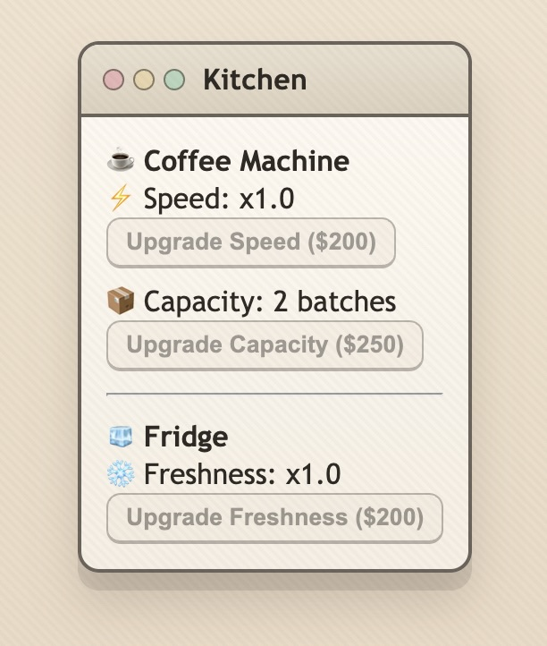
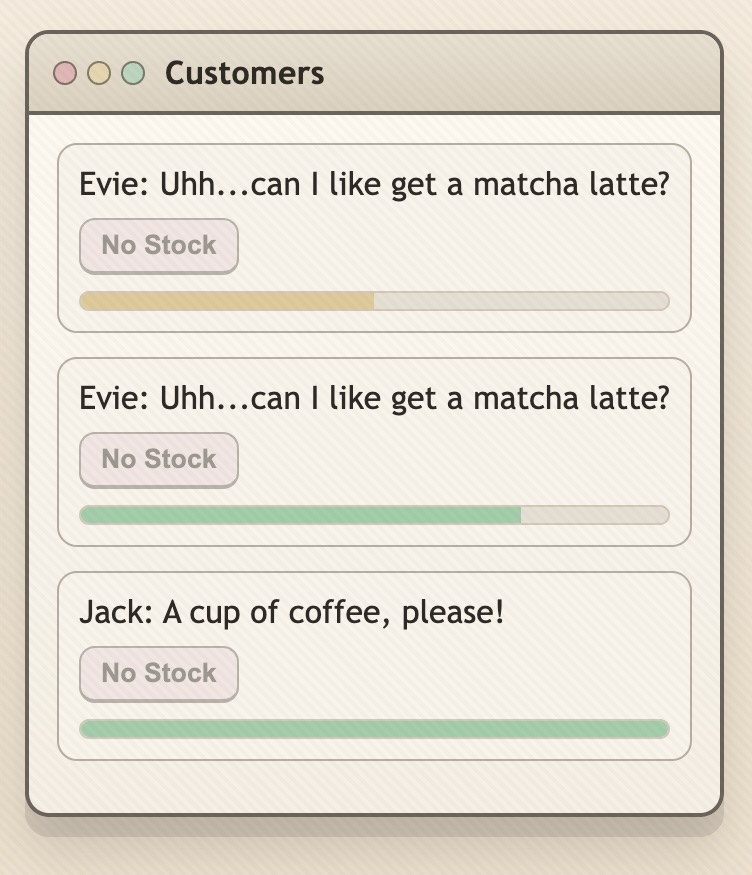

# Cafe Simulation System

  <em>
    Browser-based cafe management and simulation system focused on inventory flow, production logic, customer behavior, and operational balancing.
  </em>

## Features
- Inventory and production systems
- Machine capacity simulation
- Customer flow logic
- Operational balancing
- Builder/debug panel
- Real-time gameplay systems
- Simulation insights and tracking

## Tech Stack
- JavaScript
- HTML/CSS
- Vercel deployment

## Purpose
Built as an experimental systems-design project to explore simulation logic, management gameplay loops, and scalable UI architecture.

## System Design

The project focuses on interconnected gameplay systems:
- inventory flow
- production timing
- machine capacity
- customer throughput
- operational balancing

## Development Goals

- Explore simulation-driven gameplay
- Experiment with scalable UI systems
- Test management-game balancing mechanics
- Prototype modular gameplay systems

## Live Demo
[Open Project](https://project-dinerdash.vercel.app/)

## Preview

### Kitchen System

Production subsystem managing machine speed, capacity, and freshness mechanics.

### Customer Flow

Customer queue and order simulation with dynamic demand and satisfaction tracking.

